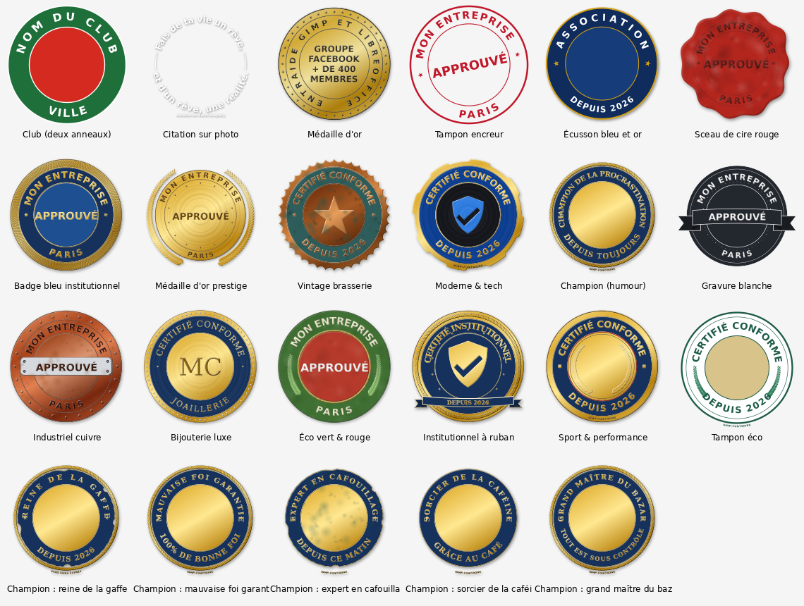

# Texte Fontwork pour GIMP 3

Greffon Python pour GIMP 3 qui met en forme du texte de quatre façons : texte déformé (arc, cercle, spirale, vague, entonnoir…), texte qui suit le contour d'une forme, texte mis en page à l'intérieur d'une forme (cœur, étoile, bulle…) ou autour d'elle et badges circulaires. Contour, dégradé, métal, biseau, ombre portée et relief 3D s'ajoutent au texte. Tout se règle depuis une seule fenêtre, avec un aperçu en direct, et le texte reste modifiable. Aucun filtre natif de GIMP n'est utilisé.




*English version: see [README.md](README.md).*

## Installation

Les chemins ci-dessous sont ceux de GIMP 3.0. Avec une version plus récente (3.2…), le dossier peut porter un autre numéro : le chemin exact est indiqué dans GIMP, menu **Édition ▸ Préférences ▸ Dossiers ▸ Greffons**.

Le dossier doit s'appeler `fontwork`, comme le script `fontwork.py`. Il contient `fontwork.py`, `fontwork_core.py`, le dossier `formes` (formes SVG fournies), le dossier `captures` (images du README), `README.md`, `LISEZMOI.md` et `LICENSE`.

### Windows

1. Copiez le dossier `fontwork` dans `%APPDATA%\GIMP\3.0\plug-ins\` (ou `3.2`, selon votre version de GIMP).
2. Redémarrez GIMP.

### macOS

1. Copiez le dossier `fontwork` dans `~/Library/Application Support/GIMP/3.0/plug-ins/`.
2. Dans un terminal : `chmod +x ~/Library/Application\ Support/GIMP/3.0/plug-ins/fontwork/fontwork.py`
3. Redémarrez GIMP.

### Linux Debian

**Debian 13 « Trixie » et versions suivantes** (GIMP 3 dans les dépôts officiels) :

```bash
# 1. GIMP 3 et les modules Python nécessaires au greffon
sudo apt update
sudo apt install gimp python3 python3-gi python3-gi-cairo python3-cairo gir1.2-gimp-3.0

# 2. Copie du greffon (depuis le dossier où vous avez décompressé l'archive)
mkdir -p ~/.config/GIMP/3.0/plug-ins
cp -r fontwork ~/.config/GIMP/3.0/plug-ins/
chmod +x ~/.config/GIMP/3.0/plug-ins/fontwork/fontwork.py
```

**Debian 12 « Bookworm »** : les dépôts officiels ne proposent que GIMP 2.10. Installez GIMP 3 avec Flatpak (Python et pycairo sont inclus) :

```bash
# 1. Flatpak et GIMP 3 depuis Flathub
sudo apt install flatpak
flatpak remote-add --if-not-exists flathub https://dl.flathub.org/repo/flathub.flatpakrepo
flatpak install flathub org.gimp.GIMP

# 2. Copie du greffon
mkdir -p ~/.var/app/org.gimp.GIMP/config/GIMP/3.0/plug-ins
cp -r fontwork ~/.var/app/org.gimp.GIMP/config/GIMP/3.0/plug-ins/
chmod +x ~/.var/app/org.gimp.GIMP/config/GIMP/3.0/plug-ins/fontwork/fontwork.py
```

**Vérifications**

- Version de GIMP : `gimp --version` (ou `flatpak run org.gimp.GIMP --version`). Il faut une version 3.x.
- Modules Python (paquets Debian) : `python3 -c "import gi, cairo; gi.require_version('Gimp', '3.0'); from gi.repository import Gimp; print('OK')"`
- Si le menu n'apparaît pas, lancez GIMP depuis un terminal (`gimp` ou `flatpak run org.gimp.GIMP`) pour lire les messages d'erreur.
- Si GIMP a été ouvert avant la copie, redémarrez-le.

Le greffon se trouve ensuite dans le menu **Calque ▸ Texte Fontwork…**

## Utilisation

Le greffon a quatre modes, choisis en haut de la fenêtre : **Texte déformé**, **Texte sur chemin**, **Texte dans ou hors d'une forme** et **Badge / sceau**. Chaque mode propose des **modèles** de départ ; tout reste ensuite modifiable (textes, couleurs, tailles, rayons…). Le bouton *Enregistrer…* garde vos propres réglages comme modèle personnel ; ils apparaissent ensuite dans la liste avec une ★.

Le bouton **Galerie…** affiche tous les modèles du mode en cours sous forme de vignettes, calculées avec vos textes : un clic applique le modèle. Les vignettes sont gardées dans le dossier `fontwork-vignettes` du profil GIMP, ce qui rend les ouvertures suivantes immédiates ; ce dossier peut être supprimé sans risque.

### Mode Texte déformé

- **Modèles** : 19 modèles, dont *Cercle orange*, *Bloc 3D*, *Double arche* et *Or estampé*.
- **Texte** : le texte (sur plusieurs lignes si besoin), la police, la taille en pixels, l'espacement des lettres, l'interligne, l'alignement et la largeur. L'option *Déformer chaque ligne séparément* applique la forme à chaque ligne (par exemple deux arches superposées), avec un écart réglable.
- **Forme** : 16 formes au choix (droit, arc haut, arc bas, cercle, spirale, vague, ondulation, gonflé, pincé, dôme, cuvette, entonnoir, pyramide, perspective, montée, chevron). Selon la forme, on règle l'intensité, le nombre de vagues, l'angle de l'arc et la rotation. Les réglages sans effet sur la forme choisie sont grisés. *Grossir au centre* et *Grossir vers la droite* font varier la taille des lettres, en plus de la forme.
- **Couleurs** : remplissage aucun, uni, dégradé à 2 ou 3 couleurs, ou métal (or, argent, bronze), avec l'angle du dégradé ; épaisseur et couleur du contour.
- **Biseau** : relief bombé ou gravé sur le remplissage, avec profondeur, douceur, direction de la lumière, éclat et ombre.
- **Ombre** : décalage, flou, couleur et opacité.
- **3D** : relief (extrusion) avec profondeur, direction et couleur, automatiquement assombri vers l'arrière ; rotation 3D (basculer, pivoter) avec perspective réglable.

### Mode Texte sur chemin

Une phrase qui suit le contour d'une forme : étoile, cœur, flèche, maison, fleur, spirale, croix, cercle, ovale, vague, arche, bulle… Les onglets Texte, Couleurs, Biseau, Ombre et 3D sont les mêmes que pour le texte déformé (police, taille, espacement, largeur, dégradé, métal, contour…). L'onglet **Chemin** remplace l'onglet Forme.

- **Modèles** : *Étoile dorée*, *Cœur tendre*, *Flèche*, *Maison*, *Fleur*, *Spirale*, *Croix étoilée*, *Cercle continu*, *Vague*. Les styles de lettres du mode texte sont aussi proposés (« Lettres : … ») : ils changent l'apparence sans changer la forme.
- **Chemin suivi** : une forme SVG de la bibliothèque, ou le **tracé sélectionné dans l'image** (dessiné avec l'outil Chemins) ; dans ce cas le texte se place exactement sur le tracé.
- **Vos propres formes** : déposez vos fichiers SVG dans votre bibliothèque (`fontwork-formes` dans le dossier de profil GIMP, chemin affiché dans l'onglet). Sont lus : chemins (`path`, y compris courbes et arcs), polygones, polylignes, rectangles, cercles, ellipses, lignes et transformations. Le texte et les images intégrés dans un SVG sont ignorés.
- **Forme** : taille, rotation, et contour suivi quand le SVG en contient plusieurs (0 = le plus long).
- **Texte sur le chemin** : position le long du chemin, côté (au-dessus / centré / en dessous, c'est-à-dire à l'extérieur ou à l'intérieur d'une forme fermée), écart, inversion du sens, *Remplir le chemin* (répartit le texte sur x % de la longueur), *Répéter le texte tout autour* avec un séparateur (•, ♥, ✿…), lettres rigides ou courbées.
- **Dessiner la forme** : fond, trait et épaisseur, ou forme invisible pour ne garder que le texte.

Conseil : sur les angles rentrants (creux du cœur, pétales de la fleur), les lettres peuvent se toucher ; augmentez l'écart, l'espacement, ou décochez *Lettres rigides*.

### Mode Texte dans ou hors d'une forme

Le texte est mis en page **à l'intérieur** d'une forme (chaque ligne prend la largeur disponible à sa hauteur, comme un paragraphe qui épouse le contour d'un cœur) ou **à l'extérieur** : le texte remplit alors un cadre et contourne la forme, comme dans un magazine où le texte habille une image. Les formes sont les mêmes que pour le texte sur chemin (bibliothèque, vos SVG, ou tracé fermé de l'image). Les onglets Texte, Couleurs, Biseau, Ombre et 3D restent disponibles ; l'onglet **Forme SVG** contient la forme et la mise en page.

- **Modèles** : à l'intérieur, *Cœur*, *Étoile*, *Maison*, *Bulle*, *Cercle*, *Fleur*, *Texte seul* (forme invisible : seul le texte dessine la silhouette) ; à l'extérieur, *Autour d'un cœur* et *Autour d'une étoile*. Les styles de lettres (« Lettres : … ») sont aussi proposés.
- **Placer le texte** : à l'intérieur de la forme, ou à l'extérieur. À l'extérieur, **Largeur du cadre** et **Hauteur du cadre** (en % de la taille de la forme) fixent la zone de texte autour de la forme ; la forme est au centre du cadre.
- **Ajuster la taille pour remplir la forme** : la taille du texte est calculée pour occuper au mieux la place disponible ; la taille obtenue est affichée sous l'aperçu. Décochée, la taille choisie dans l'onglet Texte est utilisée, et un avertissement indique les mots qui ne tiennent pas.
- **Alignement** : à gauche, centré, à droite ou justifié. **Position verticale** : en haut ou centrée.
- **Marge intérieure** : distance entre le texte et le bord de la forme.
- **Zones utilisées sur chaque ligne** : *toutes* (le texte passe des deux côtés de la forme, ou dans les deux lobes du haut d'un cœur), *la plus large*, *à gauche seulement* ou *à droite seulement*. À l'extérieur, *à gauche seulement* donne une colonne de texte qui habille le côté gauche de la forme.
- **Retours à la ligne** : *texte continu* (par défaut : un retour simple devient une espace, seule une ligne vide commence un nouveau paragraphe ; idéal pour remplir la forme) ou *respecter chaque retour à la ligne* (un vers par ligne, pour la poésie). L'interligne se règle dans l'onglet Texte.
- **Justifié** : l'espace ajouté entre deux mots est limité, pour éviter les grands blancs ; une ligne trop courte reste alignée à gauche, comme la dernière ligne d'un paragraphe.

Conseil : les formes étroites (branches d'étoile, pointe du cœur) donnent un texte plus petit à l'intérieur ; à l'extérieur, un cadre trop étroit laisse des lignes vides à hauteur de la partie la plus large de la forme : élargissez le cadre ou réduisez la marge.

### Mode Badge / sceau

Pour les logos ronds, médailles, tampons et citations en cercle.

- **Modèles** : *Club (deux anneaux)*, *Citation sur photo*, *Médaille d'or*, *Tampon encreur*, *Écusson bleu et or*, *Sceau de cire rouge*, *Badge bleu institutionnel*, *Médaille d'or prestige*, *Vintage brasserie*, *Moderne & tech*, *Champion (humour)*, *Gravure blanche*, *Industriel cuivre*, *Bijouterie luxe*, *Éco vert & rouge*, *Institutionnel à ruban*, *Sport & performance*, *Tampon éco*, et cinq variantes humoristiques du Champion (*reine de la gaffe*, *mauvaise foi garantie*, *expert en cafouillage*, *sorcier de la caféine*, *grand maître du bazar*). La case *Garder mes textes en changeant de modèle* permet d'essayer plusieurs modèles sans retaper ses textes.
- **Anneaux** : diamètre et rotation du badge ; forme du bord extérieur (lisse, festonné comme un sceau de cire, dentelé comme une capsule, cranté comme un engrenage, ébréché), avec nombre et profondeur ; jusqu'à 4 anneaux, chacun avec rayon, couleur de fond (transparente possible), trait (épaisseur, couleur) et choix d'appliquer ou non la teinte métal au fond (pour garder, par exemple, une bande bleue entre des anneaux dorés).
- **Textes** : un texte en haut (lettres vers l'extérieur) et un texte en bas (lisible à l'endroit), chacun avec police, taille, couleur, rayon, contour et espacement. *Étaler sur* répartit le texte sur l'angle voulu (par exemple 335° pour un texte qui fait presque tout le tour). Un texte central sur plusieurs lignes, avec décalage vertical.
- **Décors** : filets en arc qui relient les deux textes ; couronne de motifs répétés (★, •, ✦… nombre, rayon, taille, couleur, angle de départ, orientation) ; cordelette torsadée ; guillochage (hachures ondulées dans un anneau) ; couronne de lauriers ; couronne de perles, rivets ou diamants ; bandeau sous le texte central (ruban à pointes fourchues, courbé ou droit, ou plaque avec rivets) ; forme SVG au centre (étoile, bouclier coché, vos propres SVG…), placée automatiquement au-dessus du texte central s'il y en a un ; petite mention en bas (« GIMP-FONTWORK »…) ; zone centrale circulaire pour placer une photo ou un logo (voir ci-dessous).
- **Effets** : finition métal (or, argent, bronze, cuivre), texture (métal brossé, cire, patine, rouille) avec son intensité, biseau (sur les textes ou sur tout le badge) et ombre portée. Les illustrations (personnage, animal, blason) ne sont pas dessinées par le greffon : placez votre image dans la zone centrale.

Le badge est centré sur l'image, ou sur la sélection s'il y en a une : faites d'abord une sélection sur votre photo pour y placer le badge.

**Zone centrale.** Par défaut, elle est enregistrée comme **canal** dans l'onglet *Canaux* (nommé « Fontwork : zone centrale – … »), sans laisser de sélection active : on ne risque pas de peindre ou d'effacer seulement le centre par erreur. Votre sélection éventuelle est remise telle qu'elle était. Pour utiliser la zone : clic droit sur le canal ▸ **Canal vers sélection**, puis par exemple **Édition ▸ Coller dans la sélection** pour y mettre une photo. Le choix *Sélection active* reste possible dans l'onglet *Décors*. Quand le badge est modifié, son canal est mis à jour.

### Options communes

- **Aperçu en direct sur l'image** : le calque se met à jour dans le canevas pendant que vous réglez. Ces essais n'entrent pas dans l'historique d'annulation.
- **Créer aussi un tracé** : crée en plus un chemin vectoriel du texte, utile pour un détourage ou un tracé personnalisé.
- **Fusionner avec le calque du dessous** : décochée par défaut. Cochée, le texte est fusionné dans le calque inférieur et n'est plus modifiable par le greffon.

Le texte est placé au centre de l'image, ou au centre de la sélection s'il y en a une.

## Réinitialiser (réglages d'origine)

Le bouton **Réinitialiser**, à côté de la liste des modèles, remet tous les réglages du mode en cours à leurs valeurs d'origine. Deux options : *Garder mes textes*, et *Supprimer aussi mes modèles personnels (★)*. Les réglages remis à zéro ne s'appliquent au calque qu'après **Valider**.

Réinitialisation manuelle, GIMP fermé : supprimez `fontwork-last.json` (derniers réglages utilisés) et, si vous le souhaitez, `fontwork-styles.json` (vos modèles ★), dans le dossier de profil GIMP (`%APPDATA%\GIMP\3.0\` sous Windows, `~/.config/GIMP/3.0/` sous Linux  ; le numéro peut être `3.2` selon votre version).

## Modifier un texte existant (édition non destructive)

Les réglages sont enregistrés dans le calque (sous forme de parasite) et sont conservés dans le fichier XCF. Pour modifier un texte, sélectionnez son calque *Fontwork : …* puis relancez **Calque ▸ Texte Fontwork…** : le texte, la police, la forme et les effets sont rechargés.

- **Le calque est mis à jour sur place**, sans être recréé. Il garde ses filtres non destructifs GIMP (NDE), son masque, son opacité, son mode de fusion, son nom et sa place dans la pile. Vous pouvez donc ajouter à un calque Fontwork des filtres NDE de GIMP (flou, lueur, etc.) : ils restent actifs après chaque modification.
- **Versions précédentes** : à chaque validation, la version remplacée est ajoutée à l'historique du calque (15 versions au maximum, avec date, texte et forme). La liste *Version* en haut de la fenêtre permet de revenir à l'une d'elles ; elle est enregistrée dans le XCF.
- Si vous avez déplacé le calque, son nouvel emplacement est conservé.
- Une modification se défait en une seule étape avec **Édition ▸ Annuler**.
- Un calque dupliqué garde ses réglages : on peut le modifier indépendamment de l'original.

Ce qui fait perdre la possibilité de modification :

- la case *Fusionner avec le calque du dessous* ;
- une fusion ou un aplatissement faits ensuite dans GIMP ;
- la peinture directe sur le calque : elle est effacée lors de la modification suivante. Pour retoucher, peignez plutôt sur un calque séparé ou dans un masque de calque.

Le greffon n'est pas lui-même un filtre NDE : GIMP 3 réserve ce mécanisme aux opérations GEGL, et un greffon Python ne peut pas en créer. Le résultat est équivalent, mais il faut relancer le greffon pour modifier le texte au lieu de double-cliquer sur un filtre.

## Remarques

- Les contours du texte sont produits par le moteur texte de GIMP : toutes les polices connues de GIMP sont disponibles, y compris celles de ses dossiers de polices.
- Le greffon fonctionne sur les images RVB et en niveaux de gris. Une image indexée doit d'abord être convertie : **Image ▸ Mode ▸ RVB**.
- L'entonnoir et la pyramide donnent de meilleurs résultats avec un texte sur 2 ou 3 lignes.
- En cas d'erreur, le détail est écrit dans le fichier `fontwork-erreurs.log` du dossier de profil GIMP (`%APPDATA%\GIMP\3.0\` sous Windows, `~/.config/GIMP/3.0/` sous Linux  ; le numéro peut être `3.2` selon votre version). Joignez-le si vous signalez un problème.

## Greffons et outils similaires

Aucun greffon GIMP 3 trouvé ne réunit déformation par formes, effets et texte ré-éditable. Voici les outils les plus proches :

Légende : <span style="color:#1a7f37">vert = oui</span> · <span style="color:#cf222e">rouge = non</span> · <span style="color:#d97706">orange = ni l'un ni l'autre</span>

| | **Texte Fontwork** (ce greffon) | Texte le long d'un chemin (GIMP) | Filtres de distorsion GEGL (GIMP) | GEGL Effects (LinuxBeaver) | ofn-text-along-path (Ofnuts) | Arclayer (Akkana Peck) | Fontwork (LibreOffice) |
|---|---|---|---|---|---|---|---|
| Version de GIMP | <span style="color:#d97706">3.0</span> | <span style="color:#d97706">3.0 (intégré)</span> | <span style="color:#d97706">3.0 (intégré)</span> | <span style="color:#d97706">2.10 et 3.0</span> | <span style="color:#d97706">2.10 (Python 2)</span> | <span style="color:#d97706">2.x (Python 2)</span> | <span style="color:#d97706">hors GIMP</span> |
| Formes | <span style="color:#d97706">16 (arc, cercle, spirale, vague, entonnoir…) + badges</span> | <span style="color:#d97706">suit un chemin tracé à la main</span> | <span style="color:#d97706">coordonnées polaires, ondes, etc., filtre par filtre</span> | <span style="color:#d97706">aucune</span> | <span style="color:#d97706">suit un chemin tracé à la main</span> | <span style="color:#d97706">arc uniquement</span> | <span style="color:#d97706">environ 40</span> |
| Méthode | <span style="color:#d97706">déformation des contours vectoriels</span> | <span style="color:#d97706">contours vectoriels</span> | <span style="color:#d97706">déformation des pixels</span> | <span style="color:#d97706">styles de calque</span> | <span style="color:#d97706">contours vectoriels</span> | <span style="color:#d97706">déformation des pixels</span> | <span style="color:#d97706">vectoriel</span> |
| Qualité quand la déformation est forte | <span style="color:#d97706">nette</span> | <span style="color:#d97706">nette</span> | <span style="color:#d97706">flou, trous possibles</span> | <span style="color:#d97706">sans objet</span> | <span style="color:#d97706">nette</span> | <span style="color:#d97706">trous possibles</span> | <span style="color:#d97706">nette</span> |
| Contour, dégradé, ombre | <span style="color:#1a7f37">oui</span> | <span style="color:#cf222e">non (à faire à la main)</span> | <span style="color:#cf222e">non</span> | <span style="color:#1a7f37">oui, très complet (biseau, lueur…)</span> | <span style="color:#cf222e">non</span> | <span style="color:#cf222e">non</span> | <span style="color:#1a7f37">oui</span> |
| Texte le long d'une forme SVG ou d'un tracé | <span style="color:#1a7f37">oui (12 formes, vos SVG, tracés)</span> | <span style="color:#d97706">tracé seulement</span> | <span style="color:#cf222e">non</span> | <span style="color:#cf222e">non</span> | <span style="color:#d97706">tracé seulement</span> | <span style="color:#cf222e">non</span> | <span style="color:#d97706">quelques formes</span> |
| Texte mis en page dans ou autour d'une forme | <span style="color:#1a7f37">oui (ajustement automatique)</span> | <span style="color:#cf222e">non</span> | <span style="color:#cf222e">non</span> | <span style="color:#cf222e">non</span> | <span style="color:#cf222e">non</span> | <span style="color:#cf222e">non</span> | <span style="color:#cf222e">non</span> |
| Badges (textes haut/bas, anneaux, motifs) | <span style="color:#1a7f37">oui</span> | <span style="color:#cf222e">non</span> | <span style="color:#cf222e">non</span> | <span style="color:#cf222e">non</span> | <span style="color:#cf222e">non</span> | <span style="color:#cf222e">non</span> | <span style="color:#cf222e">non</span> |
| Biseau, finition métal | <span style="color:#1a7f37">oui</span> | <span style="color:#cf222e">non</span> | <span style="color:#cf222e">non</span> | <span style="color:#1a7f37">oui</span> | <span style="color:#cf222e">non</span> | <span style="color:#cf222e">non</span> | <span style="color:#cf222e">non</span> |
| Rotation 3D en perspective | <span style="color:#1a7f37">oui</span> | <span style="color:#cf222e">non</span> | <span style="color:#d97706">filtre séparé (perspective)</span> | <span style="color:#cf222e">non</span> | <span style="color:#cf222e">non</span> | <span style="color:#cf222e">non</span> | <span style="color:#1a7f37">oui</span> |
| Relief 3D | <span style="color:#1a7f37">oui</span> | <span style="color:#cf222e">non</span> | <span style="color:#cf222e">non</span> | <span style="color:#cf222e">non</span> | <span style="color:#cf222e">non</span> | <span style="color:#cf222e">non</span> | <span style="color:#1a7f37">oui</span> |
| Aperçu en direct | <span style="color:#1a7f37">oui (fenêtre et image)</span> | <span style="color:#cf222e">non</span> | <span style="color:#1a7f37">oui</span> | <span style="color:#1a7f37">oui</span> | <span style="color:#cf222e">non</span> | <span style="color:#cf222e">non</span> | <span style="color:#1a7f37">oui</span> |
| Texte modifiable après validation | <span style="color:#1a7f37">oui (relancer le greffon)</span> | <span style="color:#cf222e">non (produit un chemin)</span> | <span style="color:#d97706">réglages du filtre modifiables</span> | <span style="color:#1a7f37">oui</span> | <span style="color:#cf222e">non</span> | <span style="color:#cf222e">non</span> | <span style="color:#1a7f37">oui</span> |
| Versions précédentes | <span style="color:#1a7f37">oui (15)</span> | <span style="color:#cf222e">non</span> | <span style="color:#cf222e">non</span> | <span style="color:#cf222e">non</span> | <span style="color:#cf222e">non</span> | <span style="color:#cf222e">non</span> | <span style="color:#cf222e">non</span> |
| Styles prêts à l'emploi et styles perso | <span style="color:#1a7f37">oui</span> | <span style="color:#cf222e">non</span> | <span style="color:#cf222e">non</span> | <span style="color:#1a7f37">oui (préréglages)</span> | <span style="color:#cf222e">non</span> | <span style="color:#cf222e">non</span> | <span style="color:#d97706">galerie</span> |
| Vrai filtre NDE GIMP | <span style="color:#cf222e">non (voir plus haut)</span> | <span style="color:#cf222e">non</span> | <span style="color:#1a7f37">oui</span> | <span style="color:#1a7f37">oui</span> | <span style="color:#cf222e">non</span> | <span style="color:#cf222e">non</span> | <span style="color:#d97706">sans objet</span> |

**En résumé :** GEGL Effects est le meilleur complément pour les styles (biseau, lueurs), et peut s'appliquer par-dessus un calque Fontwork. Le texte le long d'un chemin reste utile pour suivre une courbe libre. Texte Fontwork est le seul à réunir, dans GIMP 3, formes toutes faites, texte sur, dans ou autour d'une forme et badges, en qualité vectorielle et avec un texte qui reste modifiable.

## Sources

[Notes de version GIMP 3.2](https://www.gimp.org/release-notes/gimp-3.2.html) · [GEGL Effects](https://github.com/LinuxBeaver/Gimp_Layer_Effects_Text_Styler_Plugin_GEGL_Effects) · [Ofnuts' path tools](https://sourceforge.net/projects/gimp-path-tools/) · [ofn-text-along-path discussion](https://www.gimp-forum.net/Thread-ofn-text-along-path-issues) · [Arclayer](https://www.shallowsky.com/software/arclayer/) · [Debian: gir1.2-gimp-3.0](https://packages.debian.org/trixie/gir1.2-gimp-3.0)

## Licence

Copyright © 2026 Miguel

Ce programme est un logiciel libre ; vous pouvez le redistribuer et/ou le modifier selon les termes de la Licence publique générale GNU (GNU GPL) publiée par la Free Software Foundation, soit la version 3 de la licence, soit (à votre choix) toute version ultérieure. C'est la même licence que GIMP. Ce programme est distribué dans l'espoir qu'il sera utile, mais SANS AUCUNE GARANTIE, sans même la garantie implicite de QUALITÉ MARCHANDE ou d'ADÉQUATION À UN USAGE PARTICULIER. Le texte complet de la licence (en anglais, seule version officielle) se trouve dans le fichier `LICENSE`.

SPDX-License-Identifier: `GPL-3.0-or-later`
